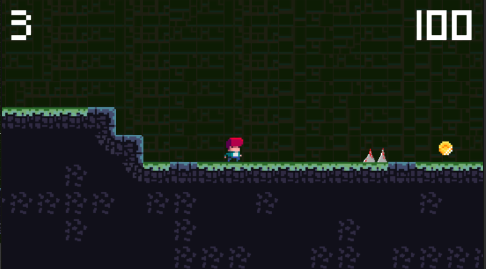
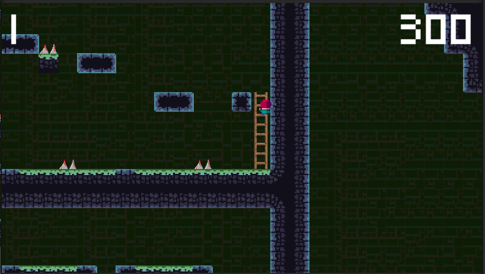

<h1>GenericVania</h1>

 A mini-game where I started learning the basics of Metroidvania games while taking the GameDev course.
This project was created for learning purposes.

If you wanna test it you can play it.
<h2>Controls</h2>
Move: w-a-s-d. 
Jump: space. 
Shoot: Left button mouse 
<h2>Objective</h2>
Finish the levels

<h2>Image</h2>

